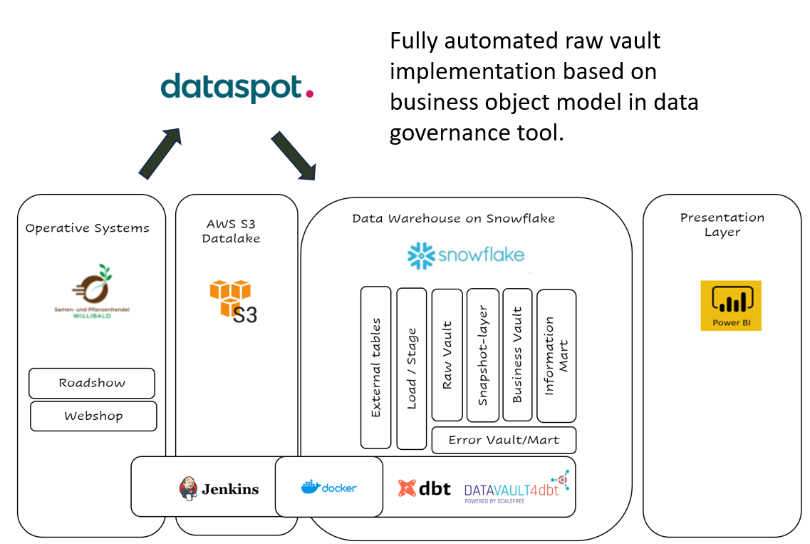

# Willibald data vault with dbt - 00 - introduction

The German speaking data vault user group ([DDVUG](https://datavaultusergroup.de/)) defined a pretty interesting data set of a seed and plant retailer called Willibald, with lots of data challenges that are pretty common within data warehouse projects.
They then asked vendors of data vault automation tools to set up a data vault data warehouse 
describing how they solved the 13 data challenges hidden within the data.
Together with requirements for business rules and some overarching functions this makes 22 criteria the tool vendors had to solve.
The idea is to have a framework to support companies in their tool selection process.

See [dwa-compare.info](dwa-compare.info) for more details on this project and the option to compare the different tools with each other.

We - two freelance data architects with extensive experience in data projects and also many years of experience in data vault and in using automation tools -   
were asked to set up the solution using [dbt](https://www.getdbt.com/) and [datavault4dbt](https://github.com/ScalefreeCOM/datavault4dbt) an open source package from [Scalefree](https://www.scalefree.com/).

## Jan Binge

  
  
Jan Binge has gained over 25 years of experience in the field of IT, out of which he has spent more than a decade as a freelance consultant specializing in "data warehouse design". Following his certification as a Datavault Practitioner in 2014, he has directed his attention towards modeling and developing data warehouse systems while also emphasizing the automation of creation processes.

willibald@binge.de  
[linkedin](linkedin.com/in/jan-binge)

## Andreas Haas
  

Andreas Haas has been working as a consultant in the business intelligence sector for over 20 years. During this time, he has successfully implemented data warehouse projects in various industries, mainly in the roles of data warehouse architect, data engineer and in project management. As a certified Data Vault 2.0 Practitioner, large metadata-driven Data Vault implementations are the main focus of his work.

willibald@haas-erlangen.de  
[linkedin](linkedin.com/in/haasandreas/)

## Original setup of the dbt solution

Here is the setup we defined for the dbt solution we presented at the TDWI in June 2023 in Munich.

Willibald has two different operative systems selling in a webshop and on regular roadshows.
We loaded the data in a datalake into S3. The dataset consists of 3 different data deliveries (we defined them as coming from 2022-03-14, 2022-03-21 and 2022-03-28).

Our data warehouse is running on Snowflake containing the layers documented here, we were using [dbt](https://www.getdbt.com/) and [datavault4dbt](https://github.com/ScalefreeCOM/datavault4dbt) from [Scalefree](https://www.scalefree.com/). 

  

## Adding business metadata workflow

In the complete solution we presented at the TDWI, we also added [dataspot.](https://www.dataspot.at/) a data governance and data modelling tool 
to define a business object model – owned by the business -  and have all the dbt models up until the Snapshot-Layer generated based on this. 

  

For more on this go to  

[Willibald_data_vault_with_dbt-06-closing_the_gap_between_business_and_tech](Willibald_data_vault_with_dbt-06-closing_the_gap_between_business_and_tech.md)

## What is this repository all about

To simplify the installation, we defined a Snowflake private share mimicking the external tables within our initial solution.  
That way no S3 setup is required and you can still gain full insights into our solution.  

  

## Tutorials/documents describing the solution

We set up the following tutorials/document to guide you through our solution:

[Willibald data vault with dbt - 00 - introduction](Willibald_data_vault_with_dbt-00-introduction.md)   
Short introduction about us and what this is all about.

[Willibald data vault with dbt - 01 - installation guidelines using ubuntu and dbt-core](Willibald_data_vault_with_dbt-01-installation_guidelines_using_ubuntu_and_dbt_core.md)  
A detailed step by step tutorial to set up our solution using an ubuntu virtual machine. 

[Willibald data vault with dbt - 01 - installation guidelines using dbt cloud](Willibald_data_vault_with_dbt-01-installation_guidelines_using_ubuntu_and_dbt_core.md)  
A detailed step by step tutorial to set up our solution using an ubuntu virtual machine. 
If you installed this, you will have the fully functional solution up and running in your own snowflake account. No prior knowledge of dbt necessary.

[Willibald data vault with dbt - 02 - solution overview](Willibald_data_vault_with_dbt-02-solution_overview.md)  
Walk through the solution describing all the components, some basic topics regarding dbt,
have a look at the different layers we set up and describe why we did it that way.

[Willibald data vault with dbt - 03 - the data challenges and how we solved them](Willibald_data_vault_with_dbt-03-the_data_challenges_and_how_we_solved_them.md)  
Description of all the data challenges presented in the data set including a description on how we solved them. This also includes SQL-code you can use in your Snowflake-environment, if you followed the installation guidelines.

[Willibald data vault with dbt - 04 - overarching functions](Willibald_data_vault_with_dbt-04-overarching_functions.md)  
Description of all the overarching functions we were required to comment on within the challenge.

[Willibald data vault with dbt - 05 - yedi tests and testing in general](Willibald_data_vault_with_dbt-05-yedi_tests_and_testing_in_general.md)  
How did we solve the yedi test challenge and some examples of singular and generic tests.

[Willibald data vault with dbt - 06 - closing the gap between business and tech](Willibald_data_vault_with_dbt-06-closing_the_gap_between_business_and_tech.md)  
Description of how we closely integrated this dbt-solution with [dataspot.](https://www.dataspot.at/en/) a data governance tool. That way we are coming close to our vision of an ideal data warehouse setup.

## Some additional links:
- [dbt](https://www.getdbt.com/) 
- [dbt cloud](https://www.getdbt.com/product/dbt-cloud) interesting SaaS-Solution from dbt labs
- [datavault4dbt](https://github.com/ScalefreeCOM/datavault4dbt) from [Scalefree](https://www.scalefree.com/)
- [DDVUG](https://datavaultusergroup.de/) German speaking data vault user group
- [DDVUG Data Warehouse automation Challenge](https://dwa-compare.info/en/start-2/) on the TDWI in June 2023
- [dataspot.](https://www.dataspot.at/en/)
- Link to Video of our [TDWI presentation](https://www.youtube.com/playlist?list=PLFcYych8PxveerZ-J9POQ4WpFcbd1rhvJ)

