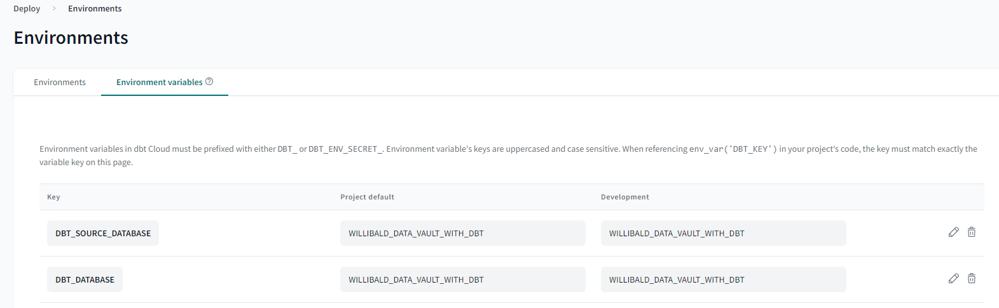

# Willibald data vault data warehouse with dbt installation guidelines using dbt cloud

For an overview of all the available tutorials and documents, go to [README](../README.md).

Within this document we will try to describe every step necessary to fully install 
the Willibald on dbt implementation in dbt cloud, trying not to assume any prior knowledge.
You don't need to know anything about Python, dbt cloud or data vault.

## Get Snowflake account running and connected
If you don’t already have a snowflake account, now is the time to do this (there is a 30 day free trial available).

### Sign up for a Snowflake account

Go to:
https://signup.snowflake.com/

For further information see: 
https://docs.snowflake.com/user-guide/admin-trial-account

The Snowflake Standard edition is enough and it doesn't matter, which cloud provider you choose and where it is located, we'd suggest to use the one nearest to you, though.

Keep the following information regarding your snowflake account, because you will need them for the configuration of dbt cloud:

    Snowflake Account:
    You will find your account in Snowflake under Admin - Accounts 
    -> click on the three dots at the end of the line with your account - Manage Urls.
    Your link will look something like https://xxxx-yy1234.snowflakecomputing.com
    only use xxxx-yy1234 as "my_account"!

    Database:
    Within Snowflake you need to create a data warehouse database.
    Let's call the database DWH_WILLIBALD (in this document and its scripts it will be referenced as this).

    Warehouse:
    Under Admin - Warehouses you can create a new Warehouse or choose a standard one.
    e.g. COMPUTE_WH

    Username:
    You can also create a specific user for accessing snowflake from dbt.

    Password:


## Connect to the source data

Our initial setup contained an AWS S3 datalake with external tables in snowflake referencing them. 
To simplify the process we now offer the data as a snowflake private share named DWA_COMPARE (mimicking the external tables). 
If you want to access it, just contact us, we are happy to add you.

See [Willibald data vault with dbt - 00 - introduction](Willibald_data_vault_with_dbt-00-introduction.md) for contact data.

All we need from you is your Snowflake account name.
Within Snowflake/Admin/Accounts click on your account and copy the link, it will look like:
https://xxxx-yy1234.snowflakecomputing.com

As soon as we added you to the private share, the database dwa_compare will show up under Snowflake/Data/Private Sharing.
You will need to click on GET to activate this private share for you.


## Set up a dbt cloud account
If you haven't already, set up a dbt cloud account:https://www.getdbt.com/signup

When asked, answer that you have a data warehouse.

  

Choose Snowflake as database
(there is an extensive documentation available in dbt, if there are any further questions).

On the following configuration page you will need all the information you gathered during the setup of your snowflake account:

Account
Database
Warehouse

User
Password

Schema 
    You can keep the default

Target name keep default
Threads keep default

--> Test connection
Let's hope you see this, otherwise check the troubleshooting pages from dbt

  

## Setup a repository

As far as we know you will need a GitHub account on your own.
Login and search for our public github repository willibald-data-vault-with-dbt

?? 
    how to include a Repo into your GitHub account?
    do I have to fork  the Repo so that I can add branches etc.?
??


Choose GitHub

LogIn and authorize dbt

  


Click: Start developing in the IDE

### Define Environment Variables

Click: Deploy - Environments
 - add the following two Variables:
  DBT_SOURCE_DATABASE   DWA_COMPARE  (the databaseshare we offer as a private share)
  DBT_DATABASE          DWH_WILLBALD (or any other DB name you chose for your DWH)

    


Back to Develop Cloud IDE 


change branch and checkout dbt-cloud


## Run the full solution

Now you can run the following command within your dbt cloud environment to generate the complete solution.
```
dbt build
```

If you did everything right and we documented everything properly, you now should have the complete solution up and running.

If you encountered any problems, found topics we should add to this description to make it easier for others to set it up, please contact us:  
See [Willibald data vault with dbt - 00 - introduction](Willibald_data_vault_with_dbt-00-introduction.md) for contact data.


