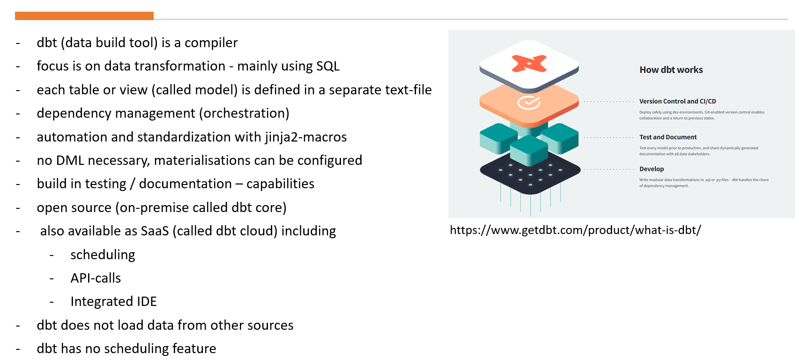
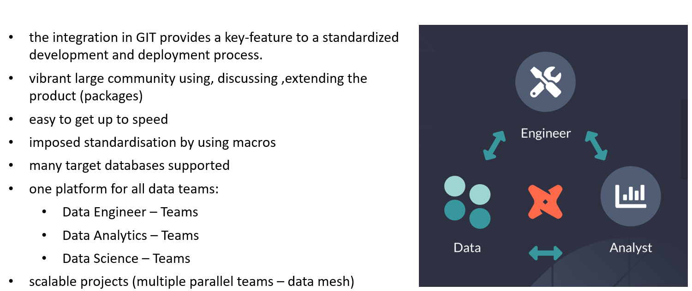
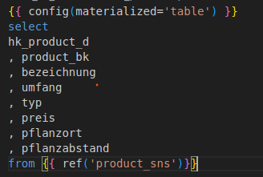
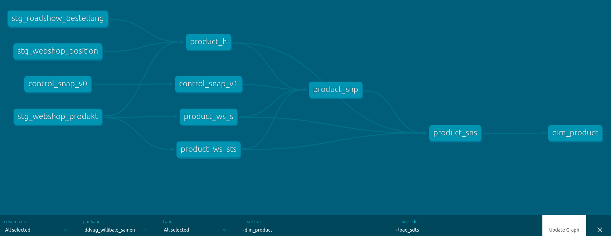
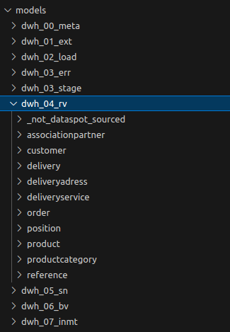

# Willibald data vault with dbt - 02 - solution overview

## What we cover in this document
In this document we will go through our solution, describing some basic features of dbt using our solution and 
have a look at the different layers we set up arguing, why we did it that way.

## Link to installation guidelines
If you followed the guide, you now have this solution up and running on your snowflake account. 
If you haven’t yet, see the installation guidelines.
For an overview of all the available tutorials and documents, go to [README](../README.md).


## Table of Contents:useful_documents/
- [Willibald data vault with dbt - 02 - solution overview](#willibald-data-vault-with-dbt---02---solution-overview)
  - [What we cover in this document](#what-we-cover-in-this-document)
  - [Link to installation guidelines](#link-to-installation-guidelines)
  - [Table of Contents:useful\_documents/](#table-of-contentsuseful_documents)
  - [What is dbt](#what-is-dbt)
  - [Why we use dbt](#why-we-use-dbt)
  - [Some major dbt topics described in our solution](#some-major-dbt-topics-described-in-our-solution)
    - [models](#models)
    - [macros](#macros)
    - [target](#target)
  - [Structure of our dbt project](#structure-of-our-dbt-project)
    - [dwh\_02\_load](#dwh_02_load)
    - [dwh\_03\_stage](#dwh_03_stage)
    - [dwh\_03\_err](#dwh_03_err)
    - [dwh\_04\_rv](#dwh_04_rv)
    - [dwh\_05\_sn](#dwh_05_sn)
    - [dwh\_06\_bv](#dwh_06_bv)
    - [dwh\_07\_inmt](#dwh_07_inmt)


## What is dbt



For more on this go to [what is dbt](https://www.getdbt.com/product/what-is-dbt/)


## Why we use dbt


  

## Some major dbt topics described in our solution
  
  
Now lets go through our dbt project and have a look at some of the main features.  

As a user, the most important folder within a dbt project is models:  
  
### models  
Each table or view is one model. You can write a simple SQL to generate a table or view, the necessary DDL will be generated by dbt based on the resultset, named like the file the sql is saved in.

One example in our solution is models/dwh_07_inmt/dim_product.sql:
   
    

{{ config(materialized='table') }} --> definition, that the result of the query should be persisted as a table, if it were changed to 'view', the next time you run the solution (dbt build), the table will be deleted and instead a view will be generated

from {{ ref('product_sns')}} --> it would also work, if you wrote a fully qualified query, but then the system wouldn't know the dependencies. 

These dependencies are used for displaying the data lineage.


To show the data lineage run the following commands:
```
dbt docs generate
dbt docs serve
```
That way, the dbt documentation will be loaded into your browser. Click on the bottom right on view lineage graph and copy 
+dim_product into --select and +load_sdts into --exclude

That way you get the lineage for dim_product on table level



On the other hand, this lineage information is also used for refreshing your data.

When running dbt build, your complete solution will be refreshed based on the available data.

If you are restricting the command to only select everything that is necessary for dim_product 
(+ before the objects means everything before, behind the object means everything afterwards), excluding load_sdts and everything before, only the things you saw in the lineage graph will be refreshed.
```
run dbt build --select +dim_product --exclude +load_sdts
```

Apart from writing nearly pure sql like in dim_product, you can also use jinga2 as a templating engine. 
The templates will be available in the subfolder macros, or within one of the corresponding subfolders within one of the additionally loaded packages.

The standardized structure of the data vault entities lend itself perfectly to using templates.

So for example models/dwh_04_rv/product/product_ws_s.sql contain all the necessary parameters and then calls the macro 
sat_v0 within the package datavault4dbt.

```
{{ config(materialized='incremental',
           unique_key=['hk_product_h', 'ldts']) }} 


source_model: "stg_webshop_produkt" 
parent_hashkey: 'hk_product_h'
src_hashdiff: 'hd_product_ws_s'
src_payload: 
  - bezeichnung
  - pflanzabstand
  - pflanzort
  - preis
  - typ
  - umfang












{{ datavault4dbt.sat_v0(parent_hashkey=parent_hashkey,
                        src_hashdiff=src_hashdiff,
                        source_model=source_model,
                        src_payload=src_payload) }}
```
### macros

You can find the macro itself within the [Scalefree](https://www.scalefree.com/) package [datavault4dbt](https://github.com/ScalefreeCOM/datavault4dbt)   


--> dbt_packages/datavault4dbt/macros/tables/sat_v0.sql 

Within that macro you see adapter.dispatch, which means, that dbt is searching for a database-specific macro with the name
snowflake__sat_v0 for a snowflake based project.

--> dbt_packages/datavault4dbt/macros/tables/snowflake/sat_v0.sql 

That way you can easily adapt the code for other databases.


### target

Within target\compiled\ddvug_willibald_samen\models\dwh_04_rv\product\product_ws_s.sql
you can have a look at the query, that was actually compiled based on the parameters in the model and the template being used.


## Structure of our dbt project

We structured the models of the dbt project in subfolders according to the layers, we specified.  
Within these layers we defined subfolders for each business object including all models related to it.



There is also a subfolder _not_dataspot_sourced:  
All entities from dwh_01_ext up to dwh_05_sn we generated completely automatic based on the metadata within the data governance and modelling tool [dataspot.](https://www.dataspot.at)   
apart from the ones within the aptly named folder _not_dataspot_sourced. 

For more on this see: 
[Willibald data vault with dbt - 06 - closing the gap between business and tech](Willibald_data_vault_with_dbt-06-closing_the_gap_between_business_and_tech.md)


Similar to the subfolders within the dbt project we defined one Snowflake Schema for each layer (You find the definition in dbt_project.yml).
What are the functions of each layer?

### dwh_02_load
Extracting data from json-structure  
Error Checks as defined  
High Water Marking insert  

### dwh_03_stage
Setting up all necessary hash-keys, all entities here are defined as views.

### dwh_03_err
Includes all entities necessary for saving erroneous data

### dwh_04_rv
Contain all entities belonging to the raw vault.

### dwh_05_sn
snapshot layer
Containing pits and a snapshot view based on the pit containing all  SATs surrounding the base entity of the pit, if specified in the macro.  
For more on this, see the description regarding the snapshot-layer in:
[Willibald data vault with dbt - 03 - the data challenges and how we solved them](Willibald_data_vault_with_dbt-03-the_data_challenges_and_how_we_solved_them.md)  

### dwh_06_bv
All business logic is implemented here, lots of pure SQL here.

### dwh_07_inmt
Information mart containing a Kimball style table structure with one fact-table and some dimensions around.


