# Willibald data vault with dbt - 03 - the data challenges and how we solved them

If you followed the dummies guide, you now have this solution up and running on a virtual ubuntu machine and on your snowflake account. 
If you haven’t yet, see the   

[Willibald data vault with dbt - 01 - installation guidelines for dummies](Willibald_data_vault_with_dbt-01-installation_guidelines_for_dummies.md)


Table of content:

- [Willibald data vault with dbt - 03 - the data challenges and how we solved them](#willibald-data-vault-with-dbt---03---the-data-challenges-and-how-we-solved-them)
  - [Early integration](#early-integration)
  - [Changes of Attributes (A-B-A changes in customer data)](#changes-of-attributes-a-b-a-changes-incustomerdata)
  - [Deletions of Business Keys (Deletions in customer data)](#deletions-of-business-keys-deletionsin-customer-data)
    - [What is a status satellite (\*\_sts)](#what-is-a-status-satellite-_sts)
    - [Snapshot-Layer](#snapshot-layer)
  - [Invalid foreign key (Lieferadresse has unknown Kunde)](#invalidforeignkey-lieferadressehasunknownkunde)
  - [Deletion of Orders](#deletion-of-orders)
- [(Historized) reference table](#historized-reference-table)
  - [Validity in Relationships](#validity-in-relationships)
  - [Hierarchical Link](#hierarchical-link)
  - [Multi-active Satellite](#multi-active-satellite)
  - [m : n tables](#m--n-tables)
  - [Business rules implementation](#business-rules-implementation)


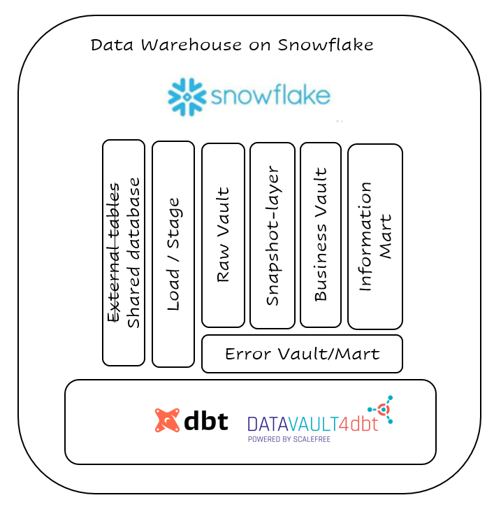

When describing the following challenges, we assume a certain level of data vault knowledge, otherwise our descriptions may be a bit hard to follow.
But if you went through the installation guideline you have the whole solution available and will hopefully be able to follow the descriptions step by step.
We tried to order the challenges from simple or easy to explain to the more complex ones on top of these.

In case you are new to data vault, there are a lot of good books and workshops available, check them out.

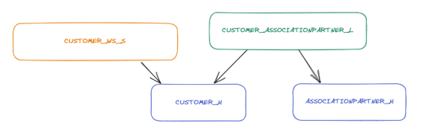

A basic definition I like
Data Vault modeling focuses on deconstructing source tables into fundamental components:   
 Hubs (for storing business keys)  
 Links (for managing relationships between data entities)  
 Satellites (for storing historical and descriptive data)  
This approach is designed to create a flexible, scalable, and agile architecture for storing and managing large volumes of data from various sources. 
Data Vault modeling promotes data traceability, scalability, and ease of adaptability to changing business requirements, making it particularly suitable for handling complex and evolving data environments, such as those encountered in modern data analytics and business intelligence scenarios.


## Early integration

There are orders from the webshop and roadshow. The orders and positions of both source-systems are loaded into the Raw Vault Hubs order_h and position_h. 
Describing data is saved in separate satellites for each source-system.

In the roadshow dataset, there is no business-key for each position of an order available, that’s why we defined it by concatinating bestellungid, produktid and row_number() on stage-level (models/dwh_03_stage/bestellung/stg_roadshow_bestellung.sql).

Each source-table loading into position_h needs to be defined as source model using the standard datavault4dbt hub-macro.

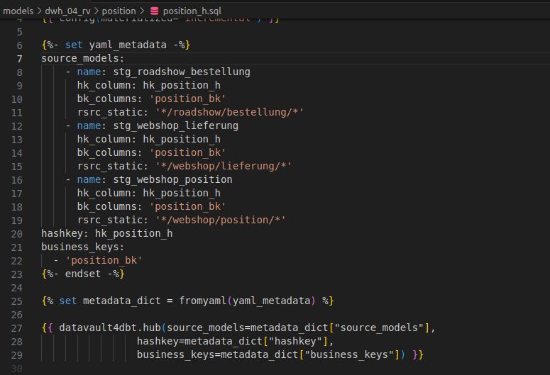

You can check it out on your snowflake account:   
```sql
-----------------------------------------------------------------------------------------------------------
-- Early Integration
-----------------------------------------------------------------------------------------------------------

select distinct rsrc  from dwh_willibald.dwh_04_rv.order_h
;
select distinct SUBSTRING(rsrc, 
                 CHARINDEX('/', rsrc) + 1, 
                 CHARINDEX('/', rsrc, CHARINDEX('/', rsrc) + 1) - CHARINDEX('/', rsrc) - 1) as source_system
from dwh_willibald.dwh_04_rv.order_h
;
--> there is data from webshop and roadshow in the hub order_h
select 
*
from dwh_willibald.dwh_04_rv.position_h
;
--> the position_bk is set up of bestellungid, produktid and a row_number
```   

## Changes of Attributes (A-B-A changes in customer data)

A pretty simple test case for a standard implementation, the data in the customer (KundeID 107) is changed to a value in delivery 2 and get the values from delivery 1 again in delivery 3.
This type of change is handled correctly by the datavault4dbt-macro sat_v0.

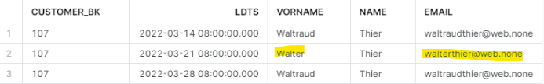


You can check it out on your snowflake account:   
```sql
-----------------------------------------------------------------------------------------------------------
-- Changes of Attributes (A-B-A changes in customer data)
-----------------------------------------------------------------------------------------------------------
-- in the raw_vault
select 
customer_h.customer_bk
, customer_ws_s.ldts
, customer_ws_s.vorname
, customer_ws_s.name
, customer_ws_s.email
from dwh_willibald.dwh_04_rv.customer_ws_s
inner join dwh_willibald.dwh_04_rv.customer_h
on customer_ws_s.hk_customer_h=customer_h.hk_customer_h
where customer_h.customer_bk='107'
;
-- on snapshot-level
select
sdts reporting_date
, customer_bk
, vorname
, name
, email
, geburtsdatum
, geschlecht
from dwh_willibald.dwh_05_sn.customer_sns
where customer_bk='107'
order by sdts
;
```

## Deletions of Business Keys (Deletions in customer data)

In the Willibald-data, there are business-keys that are being deleted and are then reappearing at a later date.  
(e.g., CustomerID '70' appearing in the webshop-data on 14. and 28. but not on 21.)

There is no change in the attributes in the data delivery on 2022-03-14 and 2022-03-28, so there is only one row for this customer in the Satellite.
```sql
select
customer_h.customer_bk
, customer_ws_s.vorname
, customer_ws_s.name
, customer_ws_s.email
, customer_ws_s.geburtsdatum
, customer_ws_s.geschlecht
, customer_ws_s.ldts
from dwh_willibald.dwh_04_rv.customer_h
inner join dwh_willibald.dwh_04_rv.customer_ws_s -- the standard raw vault satellite from the sourcesystem webshop (ws) with all the describing attributes
on customer_h.hk_customer_h=customer_ws_s.hk_customer_h
where customer_bk='70'
;
```

### What is a status satellite (*_sts)  
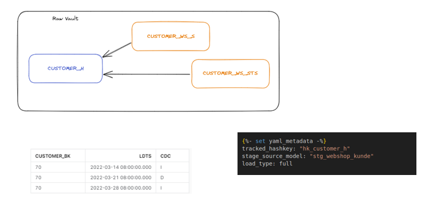


We defined a macro for the status satellite as part of the raw vault.  
This satellite includes an attribute we called cdc with I for insert and D for deleted as possible entries.  
  
The loading process depends on the kind of source data delivery.  
For all the data from the webshop we have a full load delivery, thus having to interpret a deletion within the sourcesystem, if an entry is not available.  
-> using the load_type: full  
  
For the roadshow source-table Bestellung, it is defined, that each delivery will only contain new records, and no deletions will occur.  
--> using the load_type: partial  
  
For others the macro would have to be extended.  
The easiest way would be a cdc delivery, where deletions are already delivered by the loading-process.  
  
The idea behind this construct, is to handle the kind of delivery on the way into the Raw Vault   
and don‘t have to worry about it further downstream, the status satellite will always look the same no matter how the data was delivered.  
Even if the delivery type changes over time, you will only have to change the loading-process of the status-satellite.  


### Snapshot-Layer

One possible way to facilitate all the necessary business calculations in the business vault or the information mart, is a snapshot-based approach. 
On top of each hub or link a point in time table (pit) is defined, which references the correct entry in each attached satellite for each snapshot that is defined. In this implementation, we decided to go that way. 
The pit  macro we are using here is part of the datavault4dbt standard, it generates all the snapshots defined in the table: dwh_03_stage.control_snap_v0.   
It also includes an automatic reorg of the pit, deleting all rows for snapshots no longer defined as being relevant.  
  
Based on the pit and the snapshots defined there, we created a macro to set up a view joining all the attached satellites. We called that construct snapshot-satellite. 

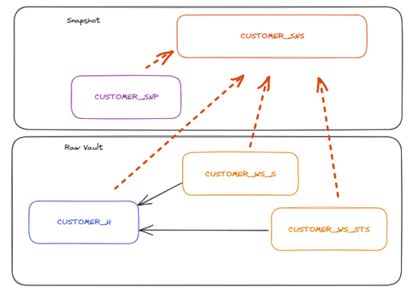

In case a status-satellite or an effectivity-satellite-view (we will cover this later) is part of that snapshot-satellite all entries containing cdc='D' will automatically be excluded.  

So when querying the customer_bk='70' on snapshot-layer, you will get data for this customer on 2022-03-14 and 2022-03-28, but not on 2022-03-21 as expected:

```sql
-- on snapshot-level
select
sdts reporting_date
, customer_bk
, vorname
, name
, email
, geburtsdatum
, geschlecht
from dwh_willibald.dwh_05_sn.customer_sns
where customer_bk='70'
order by sdts
;
```
  
Just for a better overview, we separated the pits and the snapshot-satellite-views in a separate schema, we called dwh_05_sn.

## Invalid foreign key (Lieferadresse has unknown Kunde)

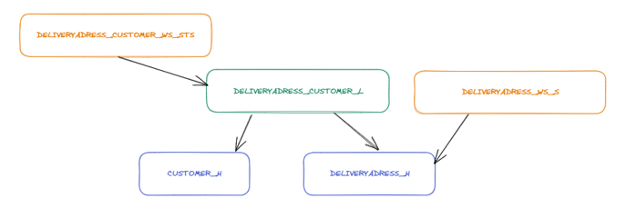


The period 1 data (2022-03-14) contain delivery addresses (lieferadresse) for customers (KundeID), for which there is no record in CUSTOMER (kunde /KundeIDs 999, 998 and 997).

The deliveryaddress table feeds the link deliveryaddress_customer_l
A sourcetable that feeds data into a link should also always feed all the hubs attached to this link. 
That way, it doesn't matter, if the customers are already available in the customertable, no available information will be lost.
It is possible to define a list of sourcetables to feed into the hub using the datavault4dbt.hub template.
  
  
```sql
select 
*
from dwh_willibald.dwh_02_load.load_webshop_lieferadresse  
-- be aware of the high water marking logic. There will only be data in here on the first run or when you call dbt build --full-refresh!
where kundeid in ('997', '998', '999')
;

-- these three customer_bk have lieferadresse as recordsource (rsrc) 
select 
*
from dwh_willibald.dwh_04_rv.customer_h
where customer_bk in ('997', '998', '999')
```
  
  
## Deletion of Orders

For whatever reason, some orders are deleted between the different deliveries.  
Between period 1 and 2 the orderIDs (BestellungID) 99, 220 and 465.  
Between periods 2 and 3 the orderIDs (BestellungID) 1470 and 1288.  


Within the status-satellite ORDER_WS_STS, a new record with cdc=D is added for orderID=99, when loading period 2.  
This leads to this order not being part of the „snapshot-satellite“ 
order_sns, for each reporting_date after period 2.

```sql
select 
sdts reporting_date
, order_bk
from dwh_willibald.dwh_05_sn.order_sns
where order_bk in ('99', '220', '465', '1288', '1470', '1' /*a order that wasn't deleted will show up at every following reporting_date*/)
order by sdts, order_bk
;
```

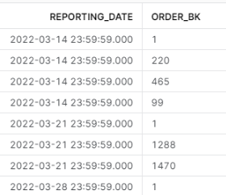

  
  
# (Historized) reference table

The data for delivery-adherence is being delivered twice (first day and third day of delivery) with changes to the data in-between.

These changes should be reflected in the calculation of the delivery adherence in the information mart.
In datavault4dbt two macros are provided to create a reference-table and a historized reference-table: ref_hub and ref_sat_v0. 

They create a DV-structure that is quite similar to the standard hub and satellite with the difference of using natural keys instead of hash-keys.  
We use the snapshot layer for historized reference tables similar to satellite tables.

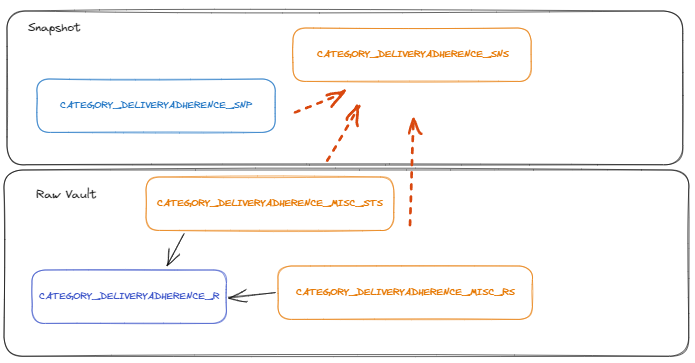


```sql
select 
sdts as reporting_date
, category_deliveryadherence_nk
, cdm_count_days_from
, cdm_count_days_to 
, cdm_name
from dwh_willibald.dwh_05_sn.category_deliveryadherence_sns
order by sdts, cdm_count_days_from
```

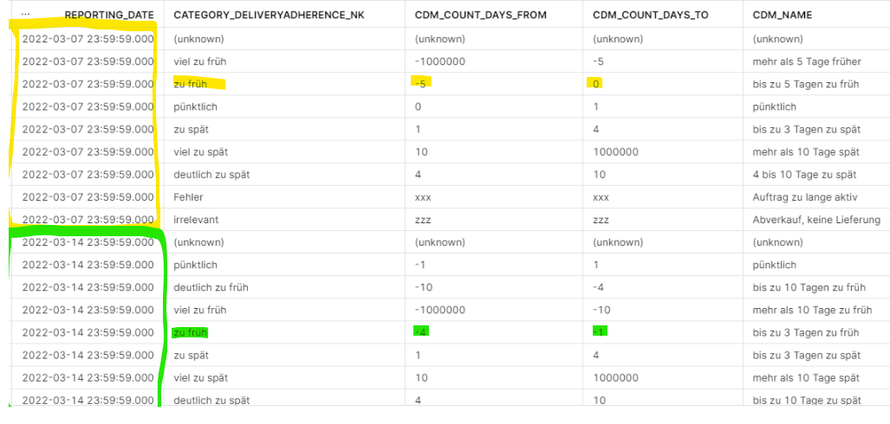


## Validity in Relationships

Testcase:  
The relationship between ORDER (Bestellung) and POSITION (Position) cannot change. The key situation makes every change a deletion and a new creation.  
All other relationships can change. 
The test cases are all implemented on the foreign key in CUSTOMER (Kunde) to ASSOCIATION PARTNER (VereinsPartner). The following situations occur here:
- the foreign key is optional and therefore also NULL
- the foreign key changes between ASSOCIATION PARTNERs
- the foreign key changes from „valid“ to „invalid“ - and in some cases then even back to „valid“ again

How we solved it:  
As you can see in the following picture, a status satellite can also be attached to a link, logging the availability of certain link entries.  
If necessary, an additional effectivity satellite (*_es) could be defined, on top of the status satellite as a view, to mark the valid entry based on 
the additional information that the customer is the driving key in this relationship. 


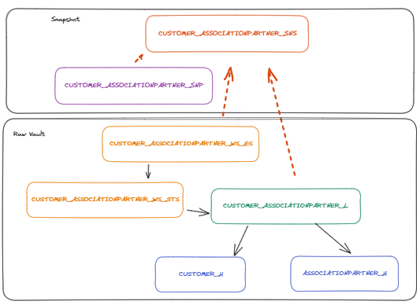

Let's have a look at customer 16:

```sql
select 
kundeid, 
vereinspartnerid, 
ldts
from  dwh_willibald.dwh_02_load.load_webshop_kunde
-- be aware of the high water marking logic. There will only be data in here on the first run or when you call dbt build
where kundeid in (16)
order by rsrc
;
```
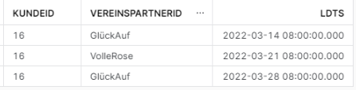

So customer 16 belongs to associationpartner GlückAuf on 2022-03-14, then changes to VolleRose on 2022-03-21, but doesn't seem to like it and 
changes back to GlückAuf again the following week.

When looking at the effectivity Satellite view for customer 16 now:
```sql
select 
customer_h.customer_bk, 
associationpartner_h.associationpartner_bk, 
customer_associationpartner_ws_es.ldts, 
customer_associationpartner_ws_es.ledts, 
customer_associationpartner_ws_es.is_current
, customer_associationpartner_ws_es.hk_customer_associationpartner_l
from dwh_willibald.dwh_04_rv.customer_h 
inner join dwh_willibald.dwh_04_rv.customer_associationpartner_l
on customer_h.hk_customer_h=customer_associationpartner_l.hk_customer_h
inner join dwh_willibald.dwh_04_rv.associationpartner_h
on associationpartner_h.hk_associationpartner_h=customer_associationpartner_l.hk_associationpartner_h
inner join dwh_willibald.dwh_04_rv.customer_associationpartner_ws_es
on customer_associationpartner_l.hk_customer_associationpartner_l=customer_associationpartner_ws_es.hk_customer_associationpartner_l
where customer_bk='16'
order by customer_associationpartner_ws_es.ldts, customer_associationpartner_ws_es.ledts
;
```

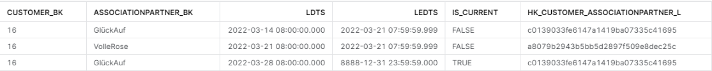

You see the following additional columns being generated in the view:
- ledts - load end date
- is_current - simplifying queries for the currently valid row

All the information of the status-satellite is available in the effectivity-satellite as well, so you don't need to add both in the snapshot-satellite.
  
## Hierarchical Link

Testcase:
There is a table Kategorie in the webshop, which includes a parent-child relationship between KatID and OberKatID with several levels

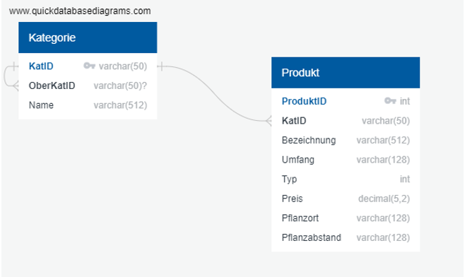

We implemented this parent-child table as a hierarchical link, as you can see this is a link referencing twice to the same hub:

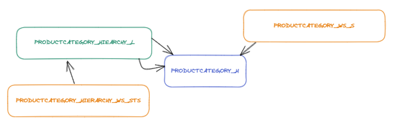

It is important, that the entries of both columns the parent and the child are loaded into the hub productcategory_h.

In models/dwh_04_rv/productcategory/productcategory_h.sql you see, that this is easily possible using the standard datavault4dbt.hub macro

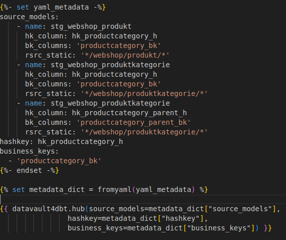


The structure of this parent-child hierarchy completely changes between the first and the second delivery and then changes back again. 
To make sure, that you can always reproduce, which information is valid, we defined a status satellite (*_sts) again and loaded all of it into  
our snapshot layer.

In the business-vault layer, we then defined a rather simple view pivoting the parent-child-table:
```sql
select
sdts
, productcategory_id_l3
, productcategory_l3
, productcategory_l2
, productcategory_l1
from dwh_willibald.dwh_06_bv.productcategory_bs
where productcategory_l3='Amaranth'
order by sdts
;
```


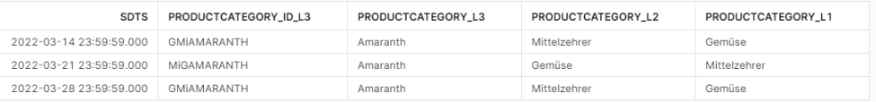


## Multi-active Satellite

In the sampledata, there is a table livingaddress (Wohnort), which include several addresses for each customer. For each address, there is also the information, from which date (von) until which date (bis) this was the relevant livingaddress.

Within data vault you usually use a multi-active Satellite for situations like this.

In a multi-active Satellite, there is - as the name aptly suggests - more than one row valid for each entry at a given point in time.
In this case there can be more than one living-address available for each customer (KundeID), separated by the column von. 
So here our multiactive-key is von.

We implemented it as customer_ws_la_ms, the ms marking it as multi-active, to make it obvious, that this table needs to be queried in a different way.

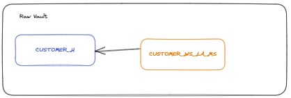


In this case, several valid rows are delivered for each customer, the multiactive-key is von.
There is a standard-macro for multi-active Satellites in datavault4dbt. 

You have to mark the multi-active key in the stage-table, because there the hash-key will be defined:
models/dwh_03_stage/wohnort/stg_webshop_wohnort.sql


But also in the raw vault entity:
models/dwh_04_rv/customer/customer_ws_la_ms.sql as src_ma_key

Each delivered set gets the same Hash_Diff. That way a change in one entry leads to including the complete set new, making this one valid from 
that time onward.

```sql
select
customer_ws_la_ms.ldts
, customer_h.customer_bk
, von
, bis
, strasse
, hausnummer
, hd_customer_ws_la_ms
from dwh_willibald.dwh_04_rv.customer_ws_la_ms
inner join dwh_willibald.dwh_04_rv.customer_h
on customer_ws_la_ms.hk_customer_h=customer_h.hk_customer_h
where customer_bk='29'
order by ldts, von
;
```

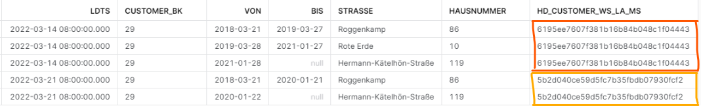


So in this example, starting from 2022-03-21 only the two last rows are the valid living-address-history for customer 29, whereas up to that moment there had been three valid entries.


## m : n tables

The deliveries – source table doesn‘t have a separate primary key and there are no changes to be expected once the deliveries are transmitted to the data warehouse.

We decided to set it up as a non-historized or transactional Link.
This was a pure modelling decision and we are aware of the debates around it.

Setting this up as a keyed instance would be technically possible in our solution as well.
This would have meant, defining a hub delivery, concatinating all the business-keys of the attached hubs to generate a surrogate business-key, defining a link joining all the hubs together and saving the describing attributes within a Satellite attached to the delivery_h.
As there actually are changes between the different deliveries - not on purpose as I was told - the second solution would have probably been better here. 

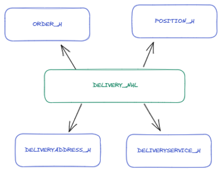


## Business rules implementation

All the business rules are implemented within the schema dwh_06_bv as pure sql based on the snapshot-layer. That way you don't have to worry about 
the historizing logic while implementing business-rules.

- order_customer_bb: Adds records for roadshow orders, where customers are missing in the order-table, but can be identified using the creditcard-information to the already existing records (in the Raw Vault stored in order_customer_l)
- sales_bb: Contains all the logic necessary for the fact-table

- a *_bs (business satellite) view is specified for each dimension, if any business-logic needs to be applied


