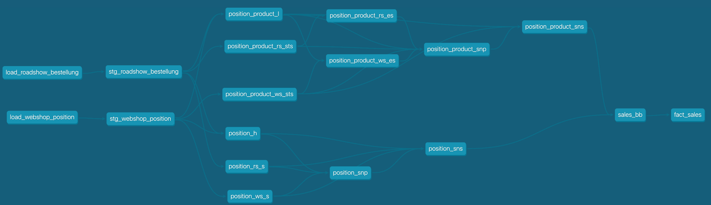
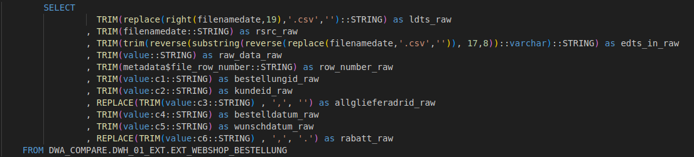
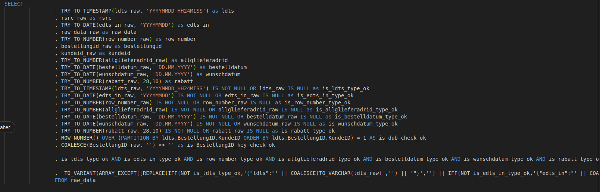
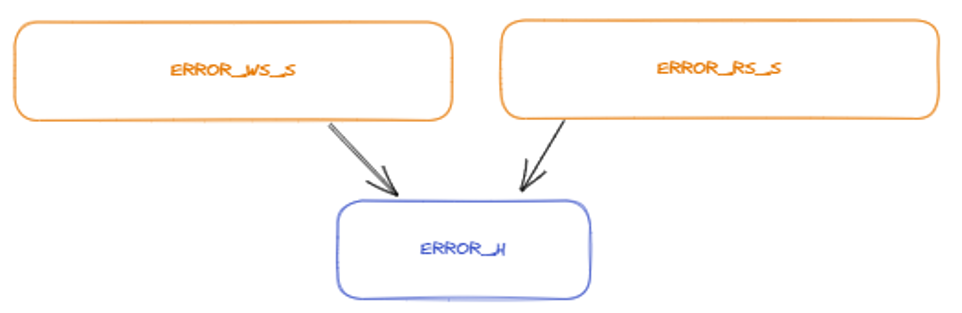
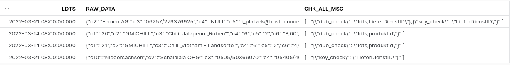
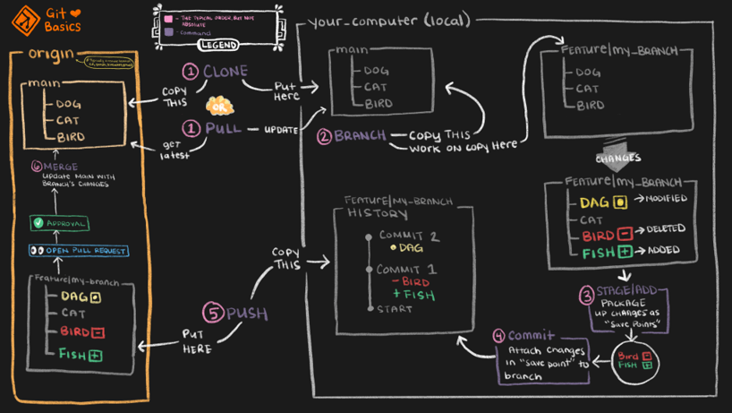
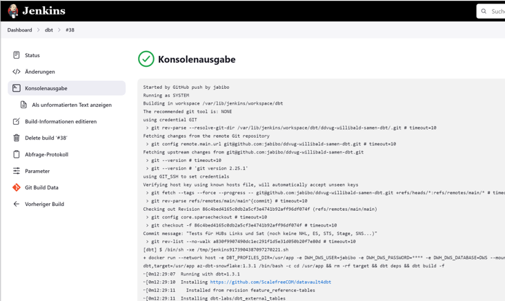
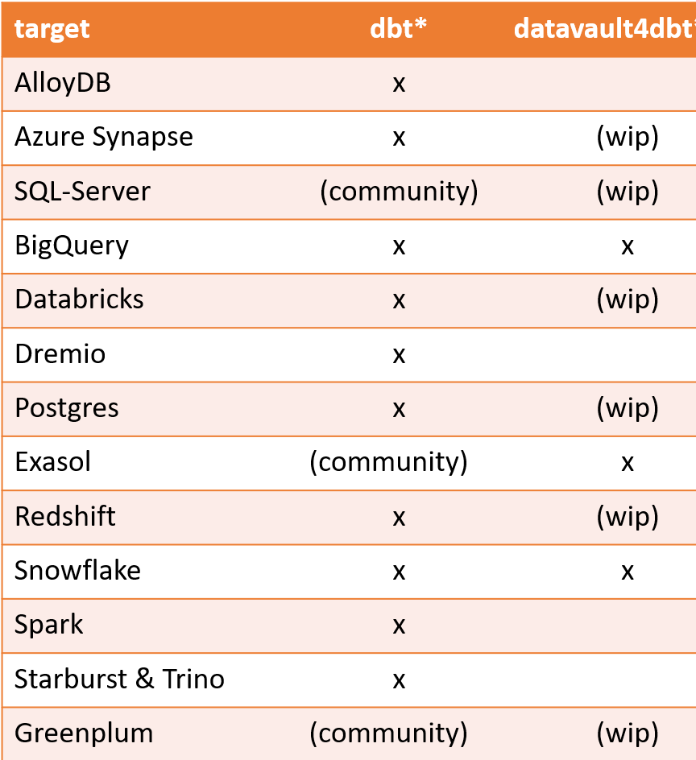
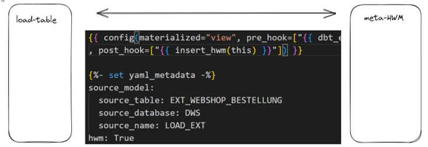

# Willibald data vault with dbt - 04 - overarching functions

## What we cover in this document
Description of all the overarching functions we were required to comment on within the challenge.


## Link to installation guidelines
If you followed the dummies guide, you now have this solution up and running on a virtual ubuntu machine and on your snowflake account. 
If you haven’t yet, see the   

[Willibald data vault with dbt - 01 - installation guidelines for dummies](Willibald_data_vault_with_dbt-01-installation_guidelines_for_dummies.md)

For an overview of all the available tutorials and documents, go to [README](../README.md).


## Table of contents
- [Willibald data vault with dbt - 04 - overarching functions](#willibald-data-vault-with-dbt---04---overarching-functions)
  - [What we cover in this document](#what-we-cover-in-this-document)
  - [Link to installation guidelines](#link-to-installation-guidelines)
  - [Table of contents](#table-of-contents)
  - [Data lineage](#data-lineage)
  - [Error Handling](#error-handling)
  - [Orchestration](#orchestration)
  - [Deployment](#deployment)
  - [Scheduling](#scheduling)
  - [Supported databases](#supported-databases)
  - [Prerequisites for the installation](#prerequisites-for-the-installation)
  - [High water marking](#high-water-marking)


## Data lineage 

When running the commands:
```
dbt docs generate

dbt docs serve
```
You get the full data lineage and all the documentation you entered on table level.



Make sure to use double curly brackets with the function ref and the table you want use in your sql for all the models you define not using any macros.
```
--instead of
from dwh_willibald.dwh_05_sn.customer_sns
-- use
from {{ ref("customer_sns)}}
```
That way dbt can build directed acyclic graphs for setting up the data lineage.
It is also used for partly refreshing the model.

Columnar lineage is not available -- in our view this really is a disadvantage of this solution. 


## Error Handling

One of the challenges we faced when creating a data warehouse pipeline is how to handle errors, such as data type errors. There are two available alternatives:

You can choose to store only text data in your raw vault. This approach allows you to load data regardless of data type issues into your raw vault. Subsequently, you will need to define and manage appropriate data types and handle data type errors downstream.

You can cast your data types while loading the data, with the understanding that your processing chain may halt in the event of an error.

Neither of these options was suitable for us, so we opted to develop a fault-tolerant loading macro.

Let's have a look at:
\target\compiled\ddvug_willibald_samen\models\dwh_02_load\load_webshop_bestellung.sql
(the target folder is available only after you first successfully ran the solution)

Step 1: Get attributes with names as VARCHAR  
CTE: raw_data  



Step 2: try_to-Cast to defined datatype  
Step 3: If result of cast is NULL and RAW-value was NOT NULL...an error has occurred: the type-check failed  
Apart from type_check, we also implemented 
- dub_check: only one row is expected for the list of columns specified here
- key_check: column is not allowed to be empty

Step 4: is_check_ok  




The macro then summarizes all defined checks in the one column "is_check_ok", which we use downstream to load all rows that are correct into 
the raw vault and all rows not ok into the error vault in dwh_03_err.

The error vault consists of a prestage-table for each source-system which gathers all the rows where is_check_ok is false.  
Using the standard - macros, this data is then loaded into an error-hub and a satellite per source-system.  
  


The Satellites hold  
- one column with generic raw-data as json 
- one column with a summary of all the failed checks
as describing attributes.

Thanks to the creators of the Willibald-data, there are some errors included for free, so when running our solution, you see the results in the error sat for the webshop:  
```sql
select 
ldts
, raw_data
, chk_all_msg
from dwh_willibald.dwh_03_err.error_ws_s
where rsrc not in ('SYSTEM', 'ERROR')
;
```





## Orchestration

- dbt uses the lineage-information to calculate the sequence to build all dependent objects. There is no need to create specific loading-chains.
- To refresh the whole model only the command dbt build has to be issued
- If only one source has new data it could be useful to refresh only this source, and all dependend models by issuing the command dbt build -s <modelname>+
- The dbt build - command will only add new data. If all data (existing in the landing zone) should be loaded, the parameter --full-refresh can be added
- To make the loading from the landing-zone more efficient, we added a high-watermark-table to the model.   
In there the latest load-date of every source is saved and only newer data is read.


## Deployment



As already stated all of the programming-artefacts in dbt are plain text files.  
dbt supports all of the gitbased tools like github, gitlab, bitbucket, Azure DevOps to keep track of versions.  
That way it is easy to implement a professional development workflow.  


## Scheduling
In our project we used Jenkins to run dbt in a docker container. 
As the Willibald-data is provided by a github-repo. We also used Jenkins to get the data and store it in the S3-Bucket.
dbt doesn't need a lot of resources because most of the work is done by the target-database-server.



## Supported databases

As of April 2023 the following databases are supported by dbt and datavault4dbt.  
Please check [dbt supported data plattforms](https://docs.getdbt.com/docs/supported-data-platforms
) or contact [Scalefree](https://www.scalefree.com/) regarding an update on supported databases for datavault4dbt.  




## Prerequisites for the installation
There are two ways to use dbt. 
There is a SAAS-solution available from [dbt-labs](https://www.getdbt.com/), the creators of dbt, it is called [dbt-cloud](https://www.getdbt.com/product/dbt-cloud) - you can create a free account there.

Or you can install dbt on a local machine, see [Willibald_data_vault_with_dbt-01-installation_guidelines_for_dummies](Willibald_data_vault_with_dbt-01-installation_guidelines_for_dummies.md) for more details.

Prerequisites for installing dbt are python (3.7+) and a git-client.
We also installed Visual Code on the virtual machine to be able to edit the text-files more comfortably.
All other installations are then done using pip or dbt (except for jenkins and docker).

## High water marking

We created a high-water marking – mechanism to make the access to the data lake more efficient.  
There is hwm-switch and a "post-hook" in every loading-model.  
If the hwm-switch is set to true it will (in incremental-load) only read from the last "High-Water-Mark" (highest ldts) which is been set by the post-hook the last time data has been inserted.  
In full-load the "High-Water-Mark" will be ignored at reading – but it will be set after loading.  
The hwm-table is located in the DWH_00_META-schema.  
There is also a hwm-mechanism integrated in datavault4dbt – which we didn't use.

