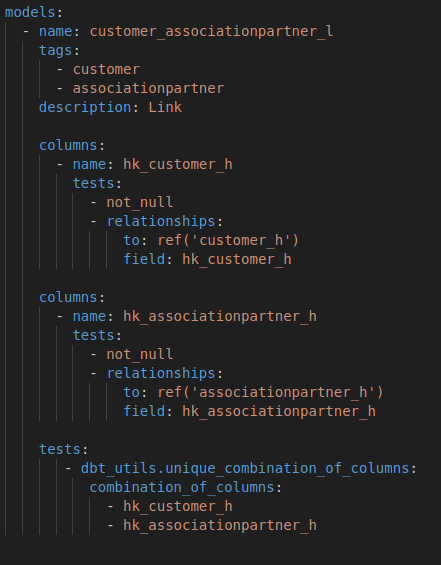
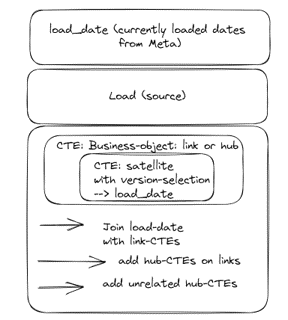

# Yedi tests and testing in general

## General testing functionality within dbt

There are two different kind of tests you can very easily add to your dbt-project (see also: [Add tests to your DAG](https://docs.getdbt.com/docs/build/tests)).
- singular tests
- generic tests

We implemented both types of tests in our solution.
One example for a singular test is in /test/singular/fact_sales_compare.sql
In there we compared the values we got from the [DDVUG] (https://datavaultusergroup.de/), on what values for the defined metrics where expected in the fact-table with the values we calculated in our solution. This test was very useful to us, because it failed every time we changed anything, that also changed the values in our fact-table in a way we didn't want. That way we got an early warning.

You will find abundant examples for generic tests within our solution, all prefixed with test_* and located in models right next to the models itself.

If you open \models\customer\test_customer_associationpartner_l.yaml, you see the standard generic tests we defined for all links.

This file contains several tests, looking at \target\compiled\ddvug_willibald_samen\models\dwh_04_rv\customer\test_customer_associationpartner_l.yaml
you will see the queries dbt generated here.

When running dbt build the tests will automatically be run as well, or call dbt test for running only the tests.

This is a very powerful way to easily add tests to a data warehouse solution, minimizing the threshold for the developer to define test as they come up during the development process.

## General functionality test of Raw Vault loading

The DDVUG simply stated as part of their [data warehouse automation challenge](https://dwa-compare.info/en/start-2/) the following request:

The functionality of the Stage and Raw Vault can be easily checked with the so-called Yedi Test. To do this, simply restore the original data from the Raw Vault and compare it against the original delivery from the Stage. This test ensures that all data has been loaded correctly.

The Yedi-Test is therefore a kind of litmus test for the correct structure and the correct loading processes of the Raw Vault. 
The aim is to have full auditability, not loosing any information, always being able to recreate all the data you got delivered based on the data being available in the Raw Vault.

It is quite an effort to set this up for every load-table within this solution by hand.  
On the other hand, the logic for joining the Raw Vault entities together for the Yedi-Test is always the same.
That's why we created another macro, to make life a bit easier for us.

In \test\yedi\ you see the configuration of the yedi-tests for each source-table 
and in \target\compiled\ddvug_willibald_samen\tests\yedi\ you can have a look at what the resulting query looks like.

In regard to the yedi-tests, we made our lifes a little bit easier, by always only checking the latest delivery and by leaving out the erroneous data.

