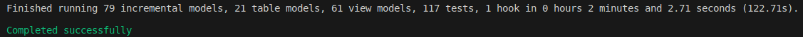
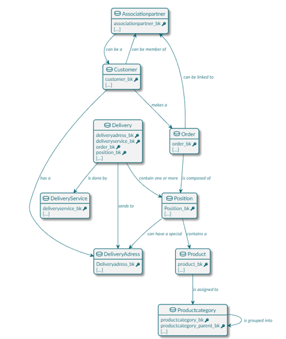
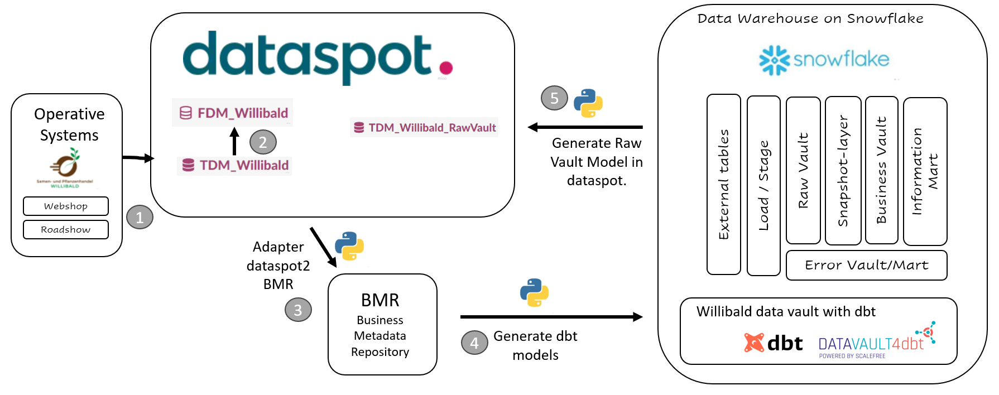
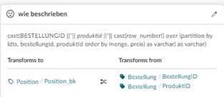
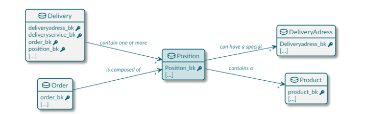
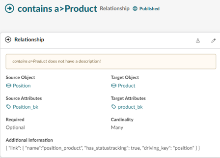
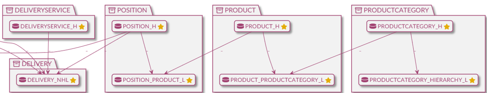
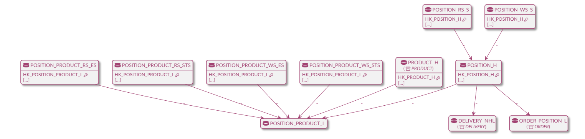
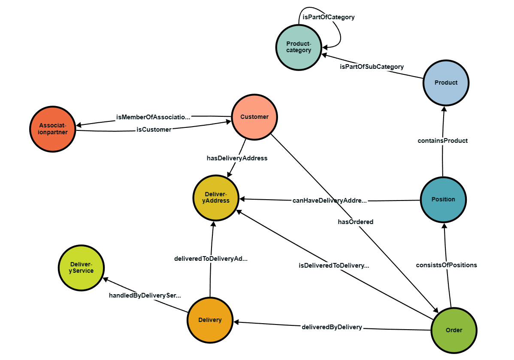

# Willibald data vault with dbt - 06 - Closing the gap between business and tech

## What we cover in this document
Description of how we closely integrated this dbt-solution with [dataspot.](https://www.dataspot.at/en/) a data governance tool. That way we are coming close to our vision of an ideal data warehouse setup.

For an overview of all the available tutorials and documents, go to [README](../README.md).

## Table of contents
- [Willibald data vault with dbt - 06 - Closing the gap between business and tech](#willibald-data-vault-with-dbt---06---closing-the-gap-between-business-and-tech)
  - [What we cover in this document](#what-we-cover-in-this-document)
  - [Table of contents](#table-of-contents)
  - [Intermediate result](#intermediate-result)
  - [Data Warehouse Automation: When Tools Create Complexity, Not Clarity](#data-warehouse-automation-when-tools-create-complexity-not-clarity)
  - [Gap between subject matter experts and data engineers](#gap-between-subject-matter-experts-and-data-engineers)
  - [Fostering Collaboration: The Key Features of a Business-Centered Data Governance Tool](#fostering-collaboration-the-key-features-of-a-business-centered-data-governance-tool)
  - [dataspot. as integral part of our toolstack](#dataspot-as-integral-part-of-our-toolstack)
  - [Business metadata flow - dataspot and dbt (automate the automation)](#business-metadata-flow---dataspot-and-dbt-automate-the-automation)
    - [dataspot transformations](#dataspot-transformations)
    - [dataspot relationships](#dataspot-relationships)
    - [dataspot generated technical datamodel Raw Vault](#dataspot-generated-technical-datamodel-raw-vault)
  - [Final thoughts](#final-thoughts)
  - [Next steps](#next-steps)
    - [Standard for a business metadata repository](#standard-for-a-business-metadata-repository)

## Intermediate result
With the described set-up, we defined a pretty powerful infrastructure for a  
fully data vault 2.0 compliant data warehouse solving - as we believe - all the issues defined in the [data warehouse automation challenge](https://dwa-compare.info/en/start-2/).

dbt follows a technical approach, allowing a professional git-based developing process, which is very good.  
Using the already existing packages and the option to add new macros or adapt existing ones using the powerful jinga2 templating engine,  
everything is ready to set up a robust and stable infrastructure. 
Using templates is also enforcing consistency between developers and development teams, reducing sql dialect diversity and thus adding to the maintainablility of the solution.

On the other hand, within this rather small setup, we already accumulated a huge list of entity-files and test-files:  

## Data Warehouse Automation: When Tools Create Complexity, Not Clarity
Not long ago, I came across a project implemented with a data warehouse automation tool (not dbt but that's not the point), which was technically set up pretty well. There was a lot of pressure migrating an existing implementation and the data engineers were working separately in several smaller teams. 
Subject matter experts were hardly involved at all. 
When I got there, I counted 11 different implementations of the customer-hub. Due to the automation tool, it was pretty easy to implement new entities, which often happened instead of coordinating a joint undrstanding. In this scenario, the automation tool proved counterproductive. It assisted in implementing a Raw Vault, which, instead of enhancing transparency only contributed to increased complexity without substantial benefits.

## Gap between subject matter experts and data engineers
Within the standard dbt setup, there is no visualization of the data model available. 
So even if there is an enterprise data model, there is the huge risk of creating a gap between the data engineers implementing the data vault and the subject matter experts.

## Fostering Collaboration: The Key Features of a Business-Centered Data Governance Tool
In our view a good data warehouse solution should promote close cooperation between the business stakeholders and the data engineers by design.

Our idea of an ideal setup would be based on a business object model as the master of the data vault. This business object model should be really business driven and owned. Any additional technical information – like the driving key for a link – should be added to the business object model in close cooperation between the business departments and the IT. This setup would lead to full transparency and thus promoting full commitment by the subject matter experts.

To address this issue, we searched for a graphical data governance/ data modelling tool to add to the toolstack and closely integrate it into our technical solution.

What are the most important features of this tool?
- it should be business centered
- easily adaptable/configurable
- the metadata should be easily extractable 
- it should support development workflows

## dataspot. as integral part of our toolstack

 
  
  
We chose [dataspot.](https://www.dataspot.at/en/) as our data modelling tool.  
Here are the main reasons for it:

- It is the #1 Data Governance Tool in BARC’s The Data Management Survey 23 
- it is business driven and based on the [Data Excellence Framework©](https://dataspot.at/wp-content/uploads/2021/07/DE_EN_Framework-Themen_Plakat_A1_20201013_v0.7_MS.pdf)  
- easily configurable, that way it is easy to add any necessary metadata  
- dataspot. is still a young company - just turned seven.  
  It is built by a very passionate, collaborative team, it is fun to work with.

Here is the business object model, we built for Willibald within dataspot.  

## Business metadata flow - dataspot and dbt (automate the automation)

1. Configure an automatic load and refresh of the datastructures of the operative systems into a technical data model (TDM_Willibald) within dataspot.
2. Define the business object model (FDM_Willibald) and set the transformations from the technical data model on attribute level.
3. The adapter dataspot2BMR extracts all necessary business metadata from dataspot. and saves it in the Business Metadata Repository
4. Based on the Business Metadata Repository all dbt models currently marked as  
      
    are being automatically generated.  
    That's nearly all of the models of the layers dwh_01_ext up until dwh_05_sn.  
    Even all the generic tests in these layers and the yedi-tests have been automatically generated.
    Only the ones saved in the subfolders _not_dataspot_sourced are currently manually built in the named layers - we just didn't find the time to tackle these as well.
5. Based on the datastructures within the Raw Vault - layer in Snowflake, we then generated another technical model in dataspot called TDM_Willibald_RawVault. This can be refreshed any time, visualizing the current model of the Raw Vault within the business centric modelling tool. 

### dataspot transformations

In the following screenshot you see the transformations defined within dataspot between the technical datamodel of the operative system and 
the business object model.
  
Here you see the different sourcetables feeding into the core business object Position.  

Any non-trivial transformations like the one to define the position-business-key from the roadshow-Bestellung  
(such a key is not available in the source table and thus has to be generated) was also defined in the tool:  
  

### dataspot relationships

  

All Relationships within the business object model will lead to links in the Raw Vault. 
All the necessary information, like the name of the link, whether statustracking is necessary or if a driving key needs to be defined is done within the relationship-definition.  
  
So adding the parameter driving_key: position to the definition and rerunning the generation-process into dbt leads to an additional effectivity sat view being generated, included into the snapshot layer and being part of the yedi-test.

### dataspot generated technical datamodel Raw Vault
When opening the Raw Vault model (that has been generated from the "real world" in Snowflake), you first see only the spine (the hubs and links, no satellites) of the Raw Vault in dataspot. To further improve the overview each Core Business Concept is loaded into its own folder.  
  

When opening the folder Position, you then see all the entities belonging to the Core Business Concept position and attached entities (their folder is then shown in brackets)

  

## Final thoughts

This setup is heading towards our idea of an ideal data warehouse solution. 
By integrating dbt with a business-centric data governance tool like dataspot we were able to reach a new level of maturity concerning the automation process. We automated the automation even further.

But most important, we are forcing all stakeholders to closely work together, thus achieving a common understanding by design :-).

For now we do accept, that the definition of all the business logic in the Business Vault and the setup of the Information Mart need to be manually defined in dbt (making organizationally sure that this fits to the definitions within the modelling tool), but there certainly are additional options to further technically align the business model with the implementation.

## Next steps

### Standard for a business metadata repository
The business metadata repository as the interface between dataspot and dbt should be set up using a standard configuration. 
That way it would be easy to swap each of the components. If your company uses another modelling tool, then only an adapter from the modelling tool into the business metadata repository needs to be written. On the other hand, if you want to use another automation tool instead of dbt, you'd just have to write the adapter to generate the artefacts your automation tool of choice needs.  
Interesting work in this regard has been done by [Roelant Vos](https://roelantvos.com/blog/), who defined a [Data Warehouse Automation Schema](https://github.com/data-solution-automation-engine/data-warehouse-automation-metadata-schema/releases/tag/v2.0). 

In our view another interesting approach as a standard for the Business Metadata Repository would be the use of W3C standard ontology languages namely RDF and R2RML. Feedback regarding this would be highly appreciated.

